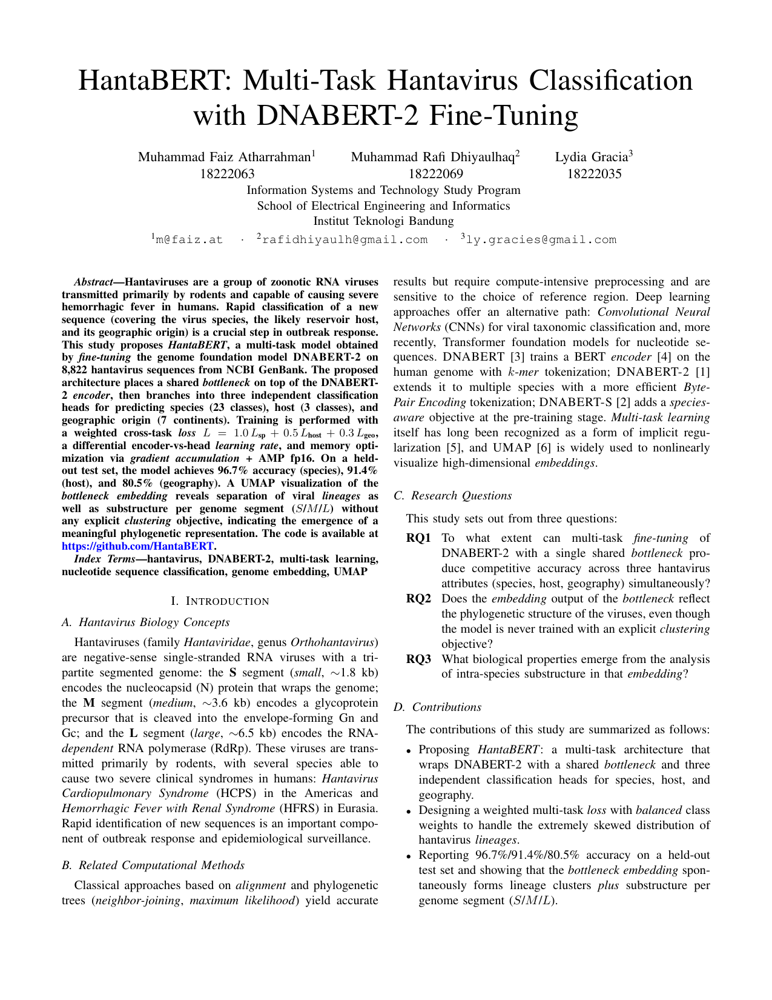

# HantaBERT: Multi-Task Hantavirus Classification with DNABERT-2 Fine-Tuning

A term-project paper (two-column, 5 pages, available in both English and Indonesian) reporting the development of **HantaBERT**, a *multi-task* model obtained by *fine-tuning* DNABERT-2 to classify hantavirus sequences across three tasks at once: species, host, and geographic origin. The paper was written for the Domain-Specific Computing course at the School of Electrical Engineering and Informatics, ITB.



## Authors

| Name | Student ID | Email |
|------|-----|-------|
| Muhammad Faiz Atharrahman | 18222063 | m@faiz.at |
| Muhammad Rafi Dhiyaulhaq | 18222069 | rafidhiyaulh@gmail.com |
| Lydia Gracia | 18222035 | ly.gracies@gmail.com |

Authors are listed alphabetically by last name.

## Summary

Hantaviruses (genus *Orthohantavirus*) are segmented negative-sense single-stranded RNA viruses that cause hemorrhagic fever with renal syndrome (HFRS) in Eurasia and cardiopulmonary syndrome (HCPS) in the Americas, with mortality reaching around 40 percent in HCPS cases. Rapid identification of the species, reservoir host, and likely geographic origin of a nucleotide sequence is essential for surveillance, but BLAST-based or classical phylogeny workflows are relatively slow and do not integrate across attributes.

HantaBERT addresses this need with a single *forward pass* that emits probabilities for all three tasks at once. Its architecture wraps DNABERT-2 (117 million parameters) with a shared 768-dimensional *bottleneck*, then branches into three independent classification heads. Training uses a weighted combined *loss* with *balanced* classes, AMP fp16, *gradient accumulation*, and a differential *learning rate* between the encoder and the task-specific parts.

## Key results

- **Accuracy on a held-out test set**: 96.7 percent for species (23 *lineages*), 91.4 percent for host (Rodent, Human, Others), and 80.5 percent for geographic origin (7 regions).
- **Embedding structure**: a UMAP projection of 8,822 sequences reveals clean per-*lineage* clusters together with substructure per genome segment (S, M, L) without any explicit supervision of the segment.
- **Biological analysis**: the S/M/L cluster separation is consistent with differences in selective pressure (conserved N protein on S, antigenic *positive selection* on Gn/Gc in M, active RdRp motifs on L).

## Paper structure

1. **Introduction** with four subsections: hantavirus biology concepts, related computational methods, research questions (RQ1 through RQ3), and contributions.
2. **Methods**: dataset and preprocessing, the full HantaBERT architecture with a TikZ flow diagram, the multi-task *loss* function, the training strategy, the web interface for inference, and code and data availability.
3. **Results and Discussion**: training progress, test-set evaluation, error analysis and biological context, UMAP visualization, and phylogenetic substructure.
4. **Conclusion** answering all three RQs plus directions for future work.
5. **References** with 10 entries.

## Released system

Beyond the model, a public web interface is also released. The *backend* (`HantaBERT-API`) uses FastAPI plus Uvicorn, packaged with Docker and *deployed* at `hantabert-api.faizath.com`. The *frontend* (`HantaBERT-Web`) is a set of pure static HTML, CSS, and JavaScript files with an interactive world map using D3 plus TopoJSON. The interface accepts raw DNA or RNA sequences or FASTA files, converts U to T automatically, and displays the *top-N* probabilistic predictions per task.

Source code repositories (GitHub organization `HantaBERT`):

- `HantaBERT` for the model, *training*, and evaluation code.
- `HantaBERT-API` for the inference service.
- `HantaBERT-Web` for the static *frontend*.

## Directory structure

```
paper/
├── hantabert-en.tex         English LaTeX source (conference class, two-column)
├── hantabert-en.pdf         compiled English output (5 pages)
├── hantabert-en.png         first-page screenshot, English (used in README)
├── hantabert-id.tex         Indonesian LaTeX source
├── hantabert-id.pdf         compiled Indonesian output (5 pages)
├── hantabert-id.png         first-page screenshot, Indonesian
└── images/                  all figures referenced by the .tex sources
    ├── training_curves.png
    ├── cm_species.png
    ├── umap_all_species.png
    ├── umap_Orthohantavirus_seoulense.png
    ├── umap_Orthohantavirus_puumalaense.png
    └── website-interface.png
```

## Rebuilding the PDF

Prerequisite: a TeX Live distribution with the `texlive-publishers` package (which provides `IEEEtran.cls`).

```bash
cd paper
pdflatex -interaction=nonstopmode hantabert-en.tex
pdflatex -interaction=nonstopmode hantabert-en.tex
```

Run `pdflatex` twice so that cross-references (`\ref`, `\label`, `\cite`) stabilize. The paper uses an inline `\begin{thebibliography}{99}` block, so no separate BibTeX step is needed. All figures are loaded from the `images/` directory via `\graphicspath{{images/}}` in the preamble. Substitute `hantabert-id.tex` for the Indonesian version.

## License and use

The paper and its figures were prepared for the academic purposes of the course. The HantaBERT, HantaBERT-API, and HantaBERT-Web code is released openly on GitHub under each repository's respective license to support reproduction and further experimentation.
