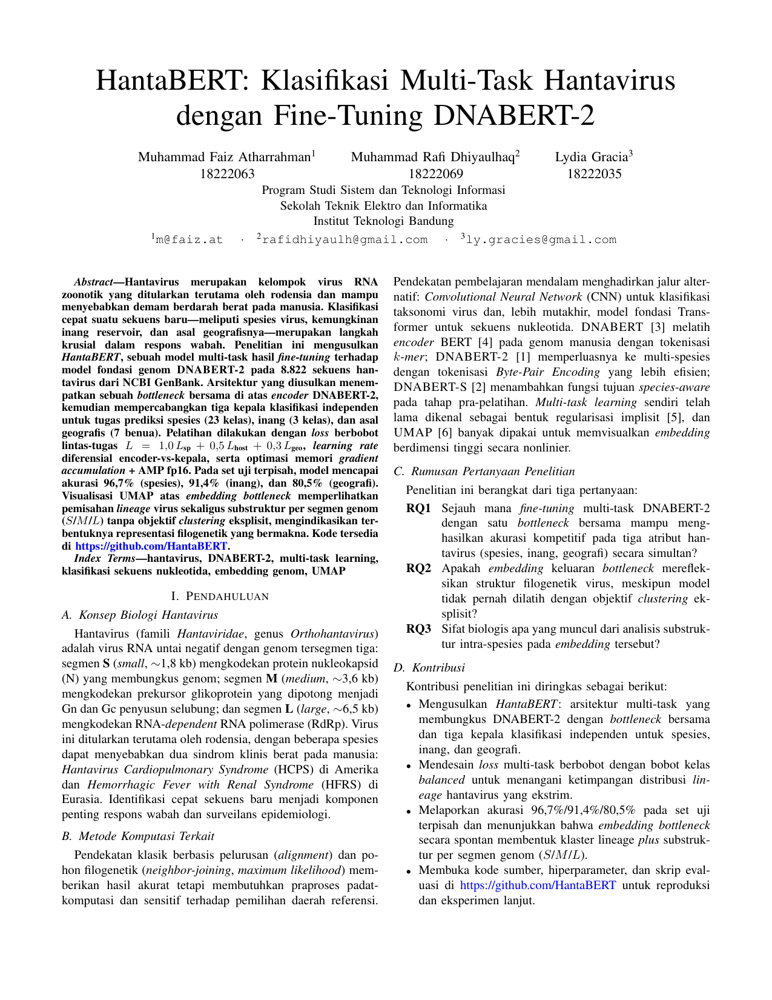

# HantaBERT: Klasifikasi Multi-Task Hantavirus dengan Fine-Tuning DNABERT-2

Makalah tugas besar (Bahasa Indonesia, dua kolom, 5 halaman) yang melaporkan pengembangan **HantaBERT**, sebuah model *multi-task* hasil *fine-tuning* DNABERT-2 untuk klasifikasi sekuens hantavirus pada tiga tugas sekaligus: spesies, inang, dan asal geografis. Makalah ini disusun sebagai Tugas Besar mata kuliah Komputasi Domain Spesifik di Sekolah Teknik Elektro dan Informatika ITB.



## Penulis

| Nama | NIM | Surel |
|------|-----|-------|
| Muhammad Faiz Atharrahman | 18222063 | m@faiz.at |
| Muhammad Rafi Dhiyaulhaq | 18222069 | rafidhiyaulh@gmail.com |
| Lydia Gracia | 18222035 | ly.gracies@gmail.com |

Penulis diurutkan secara alfabetis berdasarkan nama belakang.

## Ringkasan

Hantavirus (genus *Orthohantavirus*) adalah virus RNA untai negatif tersegmentasi yang menyebabkan demam berdarah disertai sindrom renal (HFRS) di Eurasia dan sindrom kardiopulmoner (HCPS) di Amerika, dengan tingkat mortalitas sampai sekitar 40 persen pada kasus HCPS. Identifikasi cepat spesies, inang reservoir, dan kemungkinan asal geografis dari sebuah sekuens nukleotida sangat dibutuhkan untuk surveilans, tetapi alur kerja berbasis BLAST atau filogeni klasik relatif lambat dan tidak menyatu lintas atribut.

HantaBERT menjawab kebutuhan tersebut dengan satu *forward pass* yang mengeluarkan probabilitas untuk tiga tugas sekaligus. Arsitekturnya membungkus DNABERT-2 (117 juta parameter) dengan *bottleneck* berdimensi 768 yang dipakai bersama, lalu mencabangkan tiga kepala klasifikasi independen. Pelatihan memakai *loss* gabungan berbobot dengan kelas-kelas yang di-*balance*, AMP fp16, *gradient accumulation*, dan *learning rate* diferensial antara encoder dan bagian khusus tugas.

## Hasil utama

- **Akurasi pada set uji yang terpisah**: 96,7 persen untuk spesies (23 *lineage*), 91,4 persen untuk inang (Rodent, Human, Others), dan 80,5 persen untuk asal geografis (7 wilayah).
- **Struktur embedding**: proyeksi UMAP atas 8.822 sekuens menampakkan klaster per *lineage* yang rapi disertai substruktur per segmen genom (S, M, L) tanpa pengawasan eksplisit terhadap segmen.
- **Analisis biologis**: pemisahan klaster S/M/L konsisten dengan perbedaan tekanan selektif (N protein konservatif pada S, *positive selection* antigenik pada Gn/Gc di M, motif aktif RdRp pada L).

## Struktur makalah

1. **Pendahuluan** dengan empat subbab: konsep biologi hantavirus, metode komputasi terkait, rumusan pertanyaan penelitian (RQ1 sampai RQ3), dan kontribusi.
2. **Metode**: dataset dan pra-pemrosesan, arsitektur HantaBERT lengkap dengan diagram alir TikZ, fungsi *loss* multi-task, strategi pelatihan, antarmuka web untuk inferensi, serta ketersediaan kode dan data.
3. **Hasil dan Diskusi**: progres pelatihan, evaluasi set uji, analisis kesalahan dan konteks biologis, visualisasi UMAP serta substruktur filogenetik.
4. **Kesimpulan** yang menjawab ketiga RQ ditambah arah pekerjaan lanjutan.
5. **Daftar Pustaka** dengan 10 referensi.

## Sistem yang dirilis

Selain model, dirilis pula antarmuka web publik. Sisi *backend* (`HantaBERT-API`) memakai FastAPI plus Uvicorn yang dikemas Docker dan di-*deploy* di `hantabert-api.faizath.com`. Sisi *frontend* (`HantaBERT-Web`) berupa berkas statis HTML, CSS, dan JavaScript murni dengan peta dunia interaktif memakai D3 plus TopoJSON. Antarmuka menerima sekuens DNA atau RNA mentah maupun berkas FASTA, mengonversi U menjadi T otomatis, dan menampilkan *top-N* prediksi probabilistik per tugas.

Repositori sumber kode (organisasi GitHub `HantaBERT`):

- `HantaBERT` untuk kode model, *training*, dan evaluasi.
- `HantaBERT-API` untuk layanan inferensi.
- `HantaBERT-Web` untuk *frontend* statis.

## Struktur direktori

```
paper/
├── hantabert.tex            sumber LaTeX makalah (kelas conference, dua kolom)
├── hantabert.pdf            keluaran kompilasi (5 halaman)
├── hantabert.png            tangkapan layar halaman pertama (dipakai di README)
└── images/                  semua gambar yang dirujuk oleh hantabert.tex
    ├── training_curves.png
    ├── cm_species.png
    ├── umap_all_species.png
    ├── umap_Orthohantavirus_seoulense.png
    ├── umap_Orthohantavirus_puumalaense.png
    └── website-interface.png
```

## Membangun ulang PDF

Prasyarat: distribusi TeX Live dengan paket `texlive-publishers` (menyediakan `IEEEtran.cls`).

```bash
cd paper
pdflatex -interaction=nonstopmode hantabert.tex
pdflatex -interaction=nonstopmode hantabert.tex
```

Jalankan `pdflatex` sebanyak dua kali agar referensi silang (`\ref`, `\label`, `\cite`) stabil. Makalah memakai blok `\begin{thebibliography}{99}` inline sehingga tidak perlu langkah BibTeX terpisah. Semua gambar dimuat dari direktori `images/` melalui `\graphicspath{{images/}}` di pembukaan.

## Lisensi dan penggunaan

Makalah dan figurnya disusun untuk keperluan akademik mata kuliah. Kode HantaBERT, HantaBERT-API, dan HantaBERT-Web dirilis terbuka di GitHub di bawah lisensi masing-masing repositori untuk mendukung reproduksi dan eksperimen lanjut.
